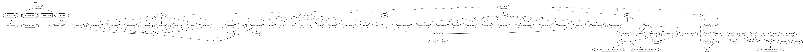

[](https://github.com/berryerlouis/Hexapodcpp/actions/workflows/build.yaml)


# Hexapodcpp

# Hexapod Robot Controller


A C++17 hexapod robot control system with layered architecture, supporting both X64 (development/testing) and Raspberry
Pi Zero 2W (production) platforms.

---

## Table of Contents

- [Quick Start](#quick-start)
- [Development Setup](#development-setup)
- [Raspberry Pi Setup](#raspberry-pi-setup)
- [Building](#building)
- [Testing](#testing)
- [Architecture](#architecture)
- [Communication](#communication)

---

## Quick Start

### Prerequisites

**Host System:**

```bash
sudo apt install build-essential gcc g++ cmake git nodejs npm
```

### Build & Run (X64)

```bash
# Build application
bin/dev/build.sh X64 sources RELEASE

# Run tests
bin/dev/test.sh all

# Start HMI
cd HMI && npm run dev
```

---

## Development Setup

### IDE and Tools

- **IDE:** VS Code or CLion
- **Node.js & npm:** Required for HMI frontend
- **Docker:** Optional, for cross-compilation

---

## Raspberry Pi Setup

### 1. System Dependencies

```bash
sudo apt update
sudo apt install build-essential gcc g++ cmake git libssl-dev
```

### 2. Install WiringPi

```bash
git clone https://github.com/WiringPi/WiringPi.git
cd WiringPi
./build
```

### 3. Enable I2C

**Edit config:**

```bash
sudo nano /boot/firmware/config.txt
# Uncomment: dtparam=i2c_arm=on
sudo modprobe i2c-dev
```

**Enable module at boot:**

```bash
sudo nano /etc/modules
# Add line: i2c-dev
```

### 4. Configure Systemd Service

**Create service file:**

```bash
sudo nano /etc/systemd/system/hexabot.service
```

**Add configuration:**

```ini
[Unit]
Description = Hexabot Robot Controller
After = network-online.target
Wants = network-online.target

[Service]
Type = simple
User = root
WorkingDirectory = /home/hexabot
ExecStart = /home/hexabot/Hexapodcpp
Restart = on-failure
RestartSec = 3s

[Install]
WantedBy = multi-user.target
```

**Enable and manage:**

```bash
# Enable service
sudo systemctl daemon-reload
sudo systemctl enable --now hexabot.service

# Check status
systemctl status hexabot.service
journalctl -u hexabot.service -e
```

---

## Building

### Using Build Scripts (Recommended)

**X64 Platform:**

```bash
# Arguments: <TARGET> <MODE> <BUILD_TYPE>
bin/dev/build.sh X64 sources DEBUG
bin/dev/build.sh X64 sources RELEASE
```

**Raspberry Pi Platform:**

```bash
# Arguments: <TARGET> <MODE> <BUILD_TYPE>
bin/dev/build.sh RPI sources RELEASE
```

```bash
# If you want to install wiringPI, add install keywork
# Arguments: <TARGET> <MODE> <BUILD_TYPE> [install]
bin/dev/build.sh RPI sources RELEASE install
```

### Cross-Compilation with Docker

```bash
# Release build (default)
./bin/dev/docker-build-rpi.sh

# Debug build
./bin/dev/docker-build-rpi.sh DEBUG

# Clean + rebuild
./bin/dev/docker-build-rpi.sh RELEASE CLEAN
```

### Debug on Rpi

```bash
# Release build (default)
./bin/dev/docker-build-rpi.sh DEBUG

# Debug build
./bin/dev/deploy-to-rpi.sh

# Clean + rebuild
./bin/dev/start-gdb-rpi.sh
```

### Manual CMake Configuration

**X64:**

```bash
cmake -DCMAKE_BUILD_TYPE=DEBUG \
      -DTARGET=X64 \
      -Wno-dev \
      -G "Unix Makefiles" \
      -S . \
      -B ./build/gcc-debug

cmake --build ./build/gcc-debug --target Hexapodcpp -- -j$(nproc)
```

**Raspberry Pi:**

```bash
cmake -DCMAKE_BUILD_TYPE=RELEASE \
      -DTARGET=RPI \
      -Wno-dev \
      -G "Unix Makefiles" \
      -S . \
      -B ./build/gcc-release

cmake --build ./build/gcc-release --target Hexapodcpp -- -j$(nproc)
```

### Production Release

```bash
bin/prod/build.sh
```

---

## Testing

### Run All Tests

```bash
bin/dev/test.sh all
```

### Run Specific Test

```bash
bin/dev/test.sh UT_MOVE_GAIT_CYCLE
```

### Manual Test Configuration

```bash
# Configure (X64 only)
cmake -DCMAKE_BUILD_TYPE=DEBUG \
      -DGTEST=1 \
      -Wno-dev \
      -G "Unix Makefiles" \
      -S . \
      -B ./build/hexapodTest

# Build
cmake --build ./build/hexapodTest --target HexapodcppTest -- -$(nproc)

# Execute
./build/hexapodTest/unittests/HexapodcppTest
```

---

## Architecture




The system follows a layered architecture:

- **App**: Composition root, dependency injection
- **Service**: High-level behaviors (Battery, Control, Communication, etc.)
- **Cluster**: Protocol handlers for external communication
- **Component**: Hardware abstractions (IMU, Servos, Sensors, etc.)
- **Bot**: Physical model (Body, Legs)
- **Move**: Gait patterns and locomotion
- **Driver**: Low-level hardware interfaces (GPIO, I2C, UART, etc.)
- **Core**: Logging, Observer pattern, status codes

### Regenerate Architecture Diagram

```bash
docker run --rm -v $PWD:/ws -w /ws plantuml/plantuml -tsvg images/architecture.puml
```

### Regenerate Architecture Diagram from cmake

```bash
bin/dev/graphviz.sh
```

---


## Web HMI

**Node Package installation :**

```bash
npm install .
```

**Start development server:**

```bash
cd HMI
npm run dev
```

**Access:** http://localhost:5173/

### WebSocket API

- **Port:** `8080`
- **Protocol:** Binary frames with cluster-based routing
- **Clusters:** Battery, Button, Body, IMU, Proximity, Servo, Sound, General

---

## License

See [LICENSE](LICENSE) file for details.
