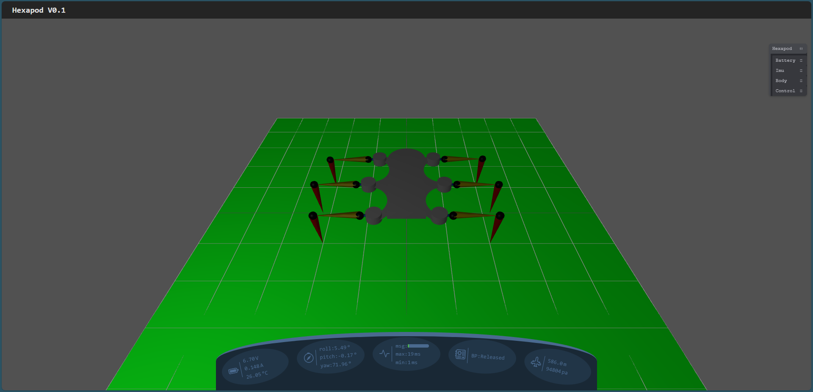
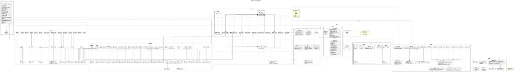

[](https://github.com/berryerlouis/Hexapodcpp/actions/workflows/build.yaml)

# Hexapod



# Install IDE and Tools

The following tools are used:

- Install VS-code or CLion
- Install nodeJs and npm

# Prepare system

``` shell
sudo apt install build-essential gcc g++ cmake git nodejs npm
```

# Configure and Compile App

## Configuration For X64

``` shell
cmake -DCMAKE_BUILD_TYPE=Debug -DTARGET=X64 -Wno-dev -G "Unix Makefiles" -S . -B ./build/gcc-debug
```

## Configuration For RPI

``` shell
cmake -DCMAKE_BUILD_TYPE=Debug -DTARGET=RPI -Wno-dev -G "Unix Makefiles" -S . -B ./build/gcc-debug
```

## Compile

``` shell
cmake --build ./build/gcc-debug --target Hexapodcpp -- -j 16
```

# Configure and Compile Google Test

## Configuration (only for X64)

``` shell
cmake -DCMAKE_BUILD_TYPE=Debug -DGTEST=1 -Wno-dev -G "Unix Makefiles" -S . -B ./build/hexapodTest
```

## Compile

``` shell
cmake --build ./build/hexapodTest --target HexapodcppTest -- -j 16
```

# Yocto

Install kas

``` shell
sudo pip install kas
```

or

``` shell
sudo apt install kas
```

Clone repo and build sdk

``` shell
git clone git@github.com:berryerlouis/yocto-rpiw.git
cd yocto-rpiw
kas build meta-raspberrypi/kas-poky-rpi.yml -c populate_sdk
cd build/tmp/deploy/sdk/
./poky-glibc-x86_64-core-image-base-arm1176jzfshf-vfp-raspberrypi0-wifi-toolchain-5.1.sh
```

# Architecture



## Render as svg

``` shell
docker run --rm -v $PWD:/ws -w /ws plantuml/plantuml -tsvg images/architecture.puml
```

# Using Cmake

## Compile

 ``` shell
 # Arguments:
 # 1: target (X64, RPI)
 # 2: source or test
 # 3: DEBUG, RELEASE, or CLEAN
 # 4: RPI install wiring PI (optional)
 bin/dev/build.sh RPI source RELEASE install
 ```

## Google Test

 ``` shell
 bin/dev/test.sh all
 ```

# Communication

## HMI

Go to HMI folder

 ``` shell
 cd HMI
 ```

and run

 ``` shell
 npm run dev
 ```

- http://localhost:5173/

## Websocket

- port: 8080
