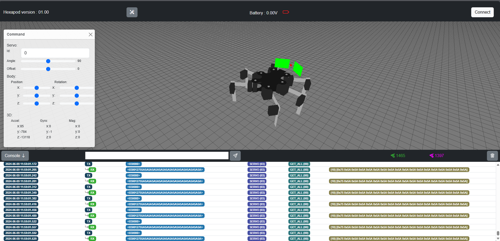
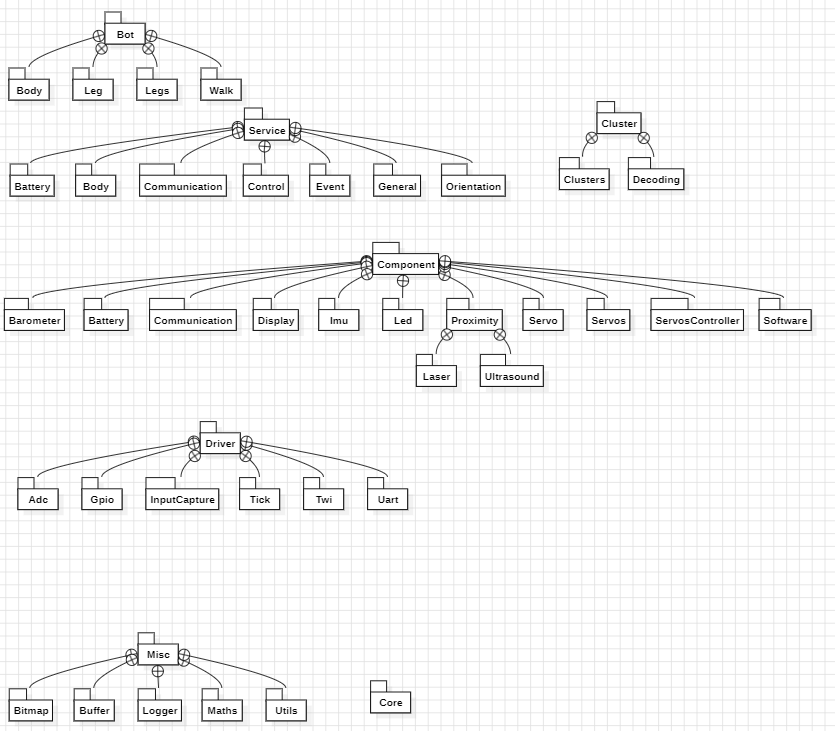

[](https://github.com/berryerlouis/Hexapodcpp/actions/workflows/build.yaml)
 
 # Hexapod

 

 # Install 
  The following tools are used:
  - Install VS-code or CLion
  - If you are using VS-code install serial-monitor extension
  - Install avr-gcc [(link windows)](https://ww1.microchip.com/downloads/aemDocuments/documents/DEV/ProductDocuments/SoftwareTools/avr8-gnu-toolchain-3.7.0.1796-win32.any.x86_64.zip) [(link linux)](https://ww1.microchip.com/downloads/aemDocuments/documents/DEV/ProductDocuments/SoftwareTools/avr8-gnu-toolchain-3.7.0.1796-linux.any.x86_64.tar.gz)

# Architecture



# Using Cmake
 ## Compile

 ``` shell
 bin/dev/build.sh 
 ```
 
## Google Test 
 ``` shell
 bin/dev/test.sh
 ```

 # Serial
 ## CLI to write firmware
 ``` shell
 bin/stack/avrdude.exe -c arduino -P COM4 -b 500000 -p m1284p -U flash:w:build/avr-debug/src/Hexapodcpp.elf
 ```
 ## On WSL 
 ### Attach to wsl
 ``` shell
 usbipd.exe bind --hardware-id=10c4:ea60 
 ```
 ``` shell
 usbipd.exe --wsl attach --hardware-id=10c4:ea60
  ```
 ### Detach to wsl
 ``` shell
 usbipd.exe unbind --hardware-id=10c4:ea60
 ```

 ## Communication settings
 - baud: 500000
 - bytes: 8
 - parity: None
 - stop bit: 1